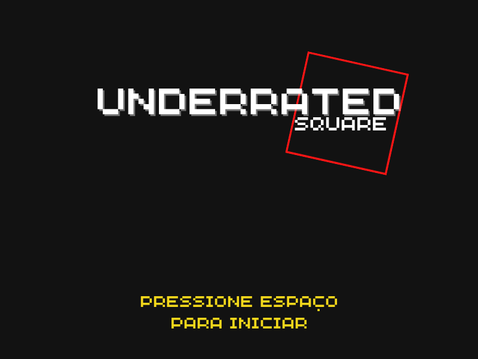
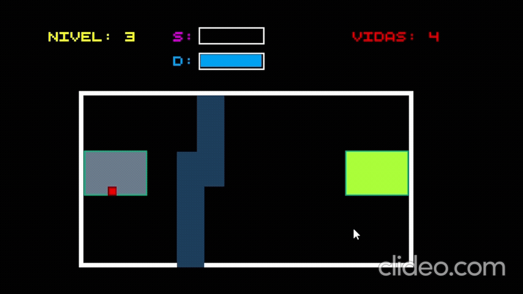
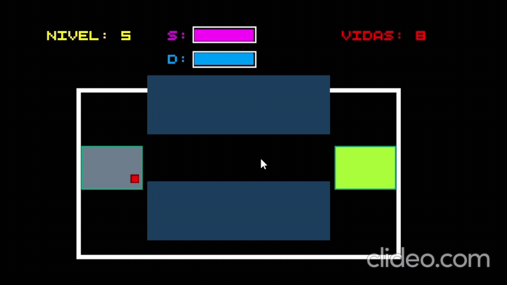
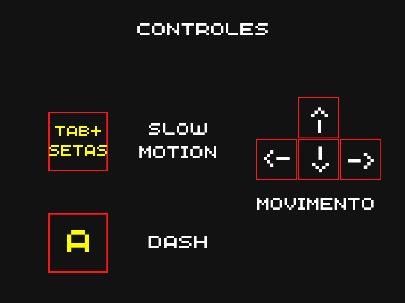

# 🎮 Underrated Square

Um jogo 2D desenvolvido em Python utilizando Pygame. Controle um pequeno quadrado em uma jornada repleta de desafios, obstáculos e novas habilidades que são desbloqueadas ao longo da aventura.

## 📸 Tela Inicial

## ✨ Habilidades

Ao longo da progressão do jogo, o jogador desbloqueia habilidades especiais que ajudam a superar obstáculos.

### ⚡ Dash

Permite realizar um impulso rápido em uma direção, facilitando a travessia de áreas perigosas e aumentando a mobilidade do personagem.

---

### 🕒 Slow Motion

Reduz temporariamente a velocidade do tempo, permitindo reações mais precisas e a execução de movimentos complexos.

## 🎮 Controles

🚀 Como Executar

Clone o repositório:

git clone https://github.com/Natannaels/Underrated-Square-Python-Version-

Entre na pasta do projeto:

cd Underrated-Square-Python-Version-

Instale as dependências:

pip install pygame

Execute o jogo:

python src/inicializador.py
